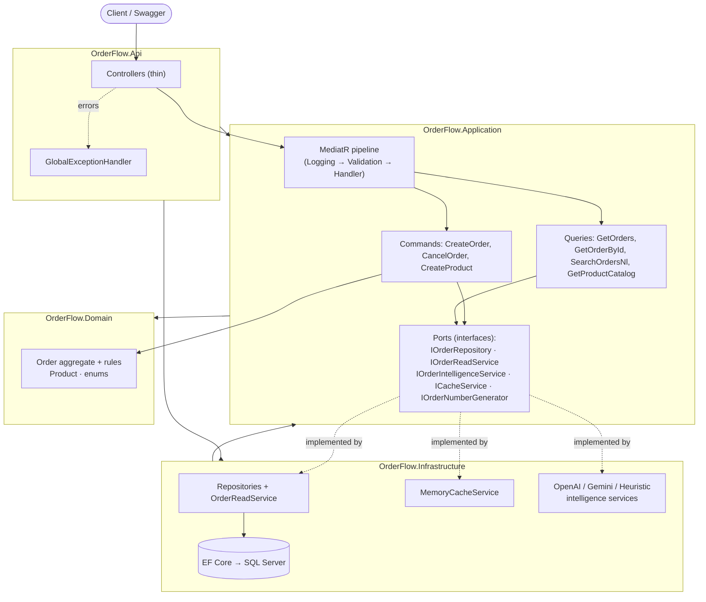
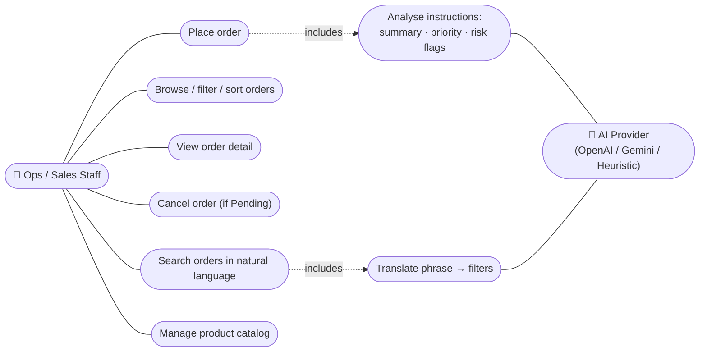
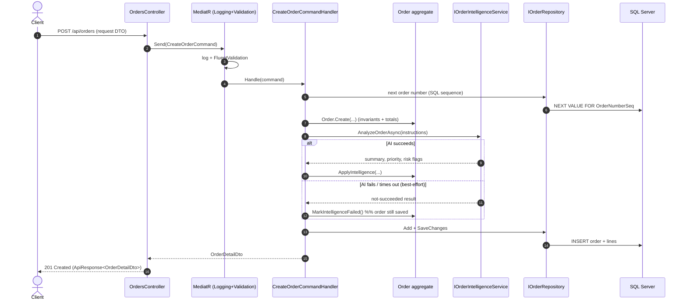

# OrderFlow API

A small, production-quality **proof-of-concept** B2B order-intake backend built with **.NET 8**
and **Clean Architecture**. It exists to demonstrate three things a client cares about on a
long-lived backend:

1. **Clean business logic** that stays clean as features are added.
2. **Performance**, shown with proof (a real benchmark on 50,000 orders).
3. **AI woven *into* the flow** — part of order intake, not a chatbot bolted on the side.

> It is intentionally a thin vertical slice: one domain (orders), one clean flow. It is not a
> full ERP.

---

## The three pillars

| Pillar | Where to look |
|---|---|
| **Clean business logic** | [`ARCHITECTURE.md`](ARCHITECTURE.md) · the `Order` aggregate in `src/OrderFlow.Domain/Entities/Order.cs` · thin controllers in `src/OrderFlow.Api/Controllers` |
| **Performance (with proof)** | [`PERFORMANCE.md`](PERFORMANCE.md) · `OrderReadService` · `tools/OrderFlow.Benchmark` (26–62× faster) |
| **AI integrated into the flow** | `IOrderIntelligenceService` + OpenAI / Gemini / offline implementations in `src/OrderFlow.Infrastructure/Intelligence` · wired into `CreateOrderCommandHandler` and `POST /api/orders/search-nl` |

---

## Prerequisites

- **.NET 8 SDK** (the repo pins it via `global.json`).
- **SQL Server** — SQL Server LocalDB works out of the box on Windows (installed with Visual
  Studio or the "SQL Server Express LocalDB" package). Any SQL Server / Azure SQL instance
  works too; just change the connection string.
- *(Optional)* an **OpenAI** or **Google Gemini** API key. Without one, the app runs a local
  **heuristic** AI provider so everything works offline.

---

## Configure

### 1. Connection string

Default (LocalDB) is already set in `src/OrderFlow.Api/appsettings.json`:

```json
"ConnectionStrings": {
  "Default": "Server=localhost\\SQLEXPRESS;Database=OrderFlow;Trusted_Connection=True;TrustServerCertificate=True;"
}
```

To point at another server, override it (don't commit real credentials) — e.g. via user-secrets
or an environment variable:

```bash
setx ConnectionStrings__Default "Server=.;Database=OrderFlow;User Id=sa;Password=your-password;TrustServerCertificate=True"
```

### 2. AI provider (optional)

The provider is chosen by config — no code change needed. **Keys live in configuration/secrets,
never in source.** Use .NET user-secrets:

```bash
cd src/OrderFlow.Api

# Use OpenAI
dotnet user-secrets set "Ai:Provider" "OpenAI"
dotnet user-secrets set "Ai:OpenAI:ApiKey" "sk-..."

# ...or use Gemini
dotnet user-secrets set "Ai:Provider" "Gemini"
dotnet user-secrets set "Ai:Gemini:ApiKey" "AIza..."
```

Providers:

| `Ai:Provider` | Behaviour |
|---|---|
| `Heuristic` *(default)* | Offline, deterministic keyword rules. No key or network needed. Lets the whole flow run and demo. |
| `OpenAI` | Calls OpenAI Chat Completions (`gpt-4o-mini` by default). |
| `Gemini` | Calls Google Gemini (`gemini-1.5-flash` by default). |

If you select `OpenAI`/`Gemini` without a key, the app safely falls back to `Heuristic` and
logs the choice at startup. Resilience (timeout + retries) and the "AI failure never blocks an
order" guarantee apply to all providers.

---

## Run

```bash
dotnet run --project src/OrderFlow.Api
```

On startup the app **applies EF migrations** and **seeds demo data** (configurable under the
`Database` section of `appsettings.json`). Then open **Swagger**:

```
https://localhost:<port>/swagger
```

The port is shown in the console. For a fixed HTTP port:

```bash
ASPNETCORE_URLS=http://localhost:5080 dotnet run --project src/OrderFlow.Api
```

### Seeded demo data

- **80 products** across 8 categories.
- **50,000 orders** with varied customers, dates (last ~180 days), statuses, free-text
  instructions, and AI results (including ~8% intentionally left "unprocessed" to show graceful
  AI degradation, and some flagged for cash-on-delivery / large quantities).

Control seeding in `appsettings.json`:

```json
"Database": {
  "ApplyMigrationsOnStartup": true,
  "SeedOnStartup": true,
  "SeedOrderCount": 50000
}
```

Set `SeedOrderCount` lower (e.g. `500`) for a fast first run.

---

## Endpoints

| Method | Route | Purpose |
|---|---|---|
| `POST` | `/api/orders` | Place an order. Free-text instructions are analysed by AI during intake; summary, priority and risk flags are persisted and returned. |
| `GET` | `/api/orders` | Paged, filtered, sorted list (projected to DTO). Query params: `Page`, `PageSize`, `Status`, `Priority`, `CustomerName`, `MinTotalUnits`/`MaxTotalUnits`, `MinTotalAmount`/`MaxTotalAmount`, `CreatedAfterUtc`/`CreatedBeforeUtc`, `RiskFlagContains`, `SortBy`, `SortDescending`. |
| `GET` | `/api/orders/{id}` | Full order by id. |
| `POST` | `/api/orders/{id}/cancel` | Cancel (allowed only while `Pending` — enforced in the domain; returns `409` otherwise). |
| `POST` | `/api/orders/search-nl` | **Natural-language search.** AI maps a phrase to *structured, validated* filters, then runs the same safe query as `GET /api/orders`. |
| `GET` | `/api/products` | Product catalog (cached). |
| `POST` | `/api/products` | Add a product (invalidates the catalog cache). |

All responses use one envelope: `{ "success": bool, "data": T, "message": string?, "errors": {}? }`.

### Try it (with the app running on port 5080)

Create an order — watch the AI fields come back populated:

```bash
curl -s -X POST http://localhost:5080/api/orders -H "Content-Type: application/json" -d '{
  "customerName":"Acme Corp",
  "specialInstructions":"URGENT - need same day delivery, customer will pay cash on delivery.",
  "lines":[{"productSku":"SKU-0001","productName":"Standard Bolt","quantity":1500,"unitPrice":3.50}]
}'
```

Natural-language search:

```bash
curl -s -X POST http://localhost:5080/api/orders/search-nl -H "Content-Type: application/json" -d '{
  "phrase":"high priority orders from last week over 500 units, largest first"
}'
```

The response echoes both the model's `interpretation` and the exact `appliedParameters` that
were validated and executed — the AI never touches the database directly.

---

## How it's laid out

```
src/
  OrderFlow.Domain          # entities, enums, rules — no framework code
  OrderFlow.Application     # MediatR commands/queries, DTOs, validators, ports (interfaces)
  OrderFlow.Infrastructure  # EF Core, repositories, read models, caching, AI clients, seeding
  OrderFlow.Api             # controllers, DI, Swagger, global exception handling
tools/
  OrderFlow.Benchmark       # naive vs optimized read benchmark (PERFORMANCE.md)
```

### Tech
.NET 8 · ASP.NET Core Web API · EF Core 8 (SQL Server) · MediatR (CQRS) · FluentValidation ·
Polly (AI resilience) · Serilog · Swagger.

---

## Architecture diagram



## Use case diagram



## Sequence diagram — `POST /api/orders`



---

## How this maps to a real engagement

This PoC is small on purpose, but each piece stands in for how a real, long-lived system would
be built:

- **Clean business logic → the system won't rot.** Rules live in the `Order` aggregate and
  nowhere else, so they can't be bypassed or duplicated as the team adds features. Controllers
  are thin, use cases are isolated MediatR slices, and boundaries (DTO ↔ entity, port ↔ adapter)
  are explicit. Adding "orders can be put on hold" or "credit-limit checks" is a new method on
  the aggregate + a new slice — not a rewrite. In an engagement this is what keeps velocity
  constant instead of decaying quarter over quarter.

- **Performance → it's measured, not asserted.** The read path projects to DTOs, uses
  `AsNoTracking`, pages server-side, and is backed by indexes chosen for the real filter/sort
  columns — proven 26–62× faster than the naive approach on 50k rows, with a repeatable
  benchmark. On a real system this is the difference between a list screen that stays snappy at
  10M rows and one that quietly degrades until it pages someone at 2am.

- **AI that fits → it earns its place in the workflow.** Intelligence is part of order intake
  (summary, priority, risk flags) and of search (natural language → validated filters), behind
  an interface with two real providers the client can choose between. It's resilient (timeouts,
  retries) and **can never break the core flow** — a model outage just means an order is saved
  with AI fields marked "unprocessed". The model never touches the database; it only proposes
  structured input that is validated exactly like any other request. That is how AI belongs in a
  system of record: additive, bounded, and safe to depend on.
